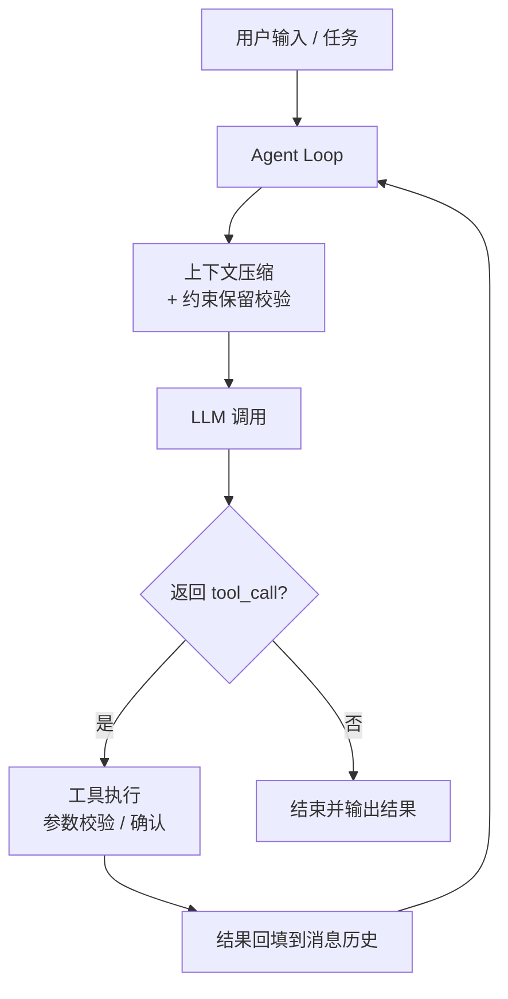

# LiteCoding Agent

> 从零实现的终端 Coding Agent，不依赖 LangChain 等 Agent 框架。核心目标：在长任务中**不丢失关键约束**。

**当前状态**：Agent Loop 已完成，工具系统开发中。各功能实现进度见「核心特性」与「路线图」。

## 为什么做

现有 Coding Agent 在长任务中会因上下文压缩丢失早期设定的关键约束（如「必须兼容 Python 3.9」「禁止修改数据库迁移文件」），导致后续步骤违反规则。本项目在复现 Claude Code 核心机制的基础上，重点解决**上下文压缩中的约束静默丢失**问题。

## 核心特性

**已实现：**

- ✅ **项目脚手架**：src-layout 打包，`lite-agent` 入口可用
- ✅ **CLI 骨架**：基于 argparse 的命令行入口与参数解析，`lite-agent chat "任务"` 可执行
- ✅ **Agent Loop**：`while(true)` 主循环，模型返回 tool_call 后就执行并回填结果，`max_turns` 默认 10
- ✅ **LLM Provider**：OpenAI 兼容协议抽象，从环境变量读取 API Key / Base URL / Model

**开发中：**

- 🚧 **工具系统**：已实现 `read_file` / `write_file` / `list_dir`（Pydantic 参数校验 + 路径越界拦截）；`bash` / `edit_file` / `grep` 待补
- 🚧 **上下文压缩**：四层策略（预算截断 / 裁剪重复 / 微压缩 / 全量摘要）
- 🚧 **关键约束保留（独有）**：压缩前提取约束、压缩后校验并自愈

**计划中：**

- 📋 **项目记忆**：加载 `AGENTS.md`，按目录层级注入项目规则
- 📋 **会话持久化**：checkpoint 保存会话状态，支持中断恢复
- 📋 **MCP 客户端**：手写 JSON-RPC over stdio，接入外部工具
- 📋 **子 Agent 隔离**：独立上下文和工具白名单

## 架构图



> 待补充：模块依赖图（`core` / `tools` / `memory` / `cli` 之间关系），见 `docs/architecture.md`。

## 快速开始

### 环境要求

- Python 3.11+
- 一个支持工具调用的 LLM API（如 Claude、GPT-4o、DeepSeek）

### 安装

```bash
git clone https://github.com/autumnieave/lite-coding-agent.git
# 网络受限时可用 SSH：git clone git@github.com:autumnieave/lite-coding-agent.git
cd lite-coding-agent
python -m venv .venv
source .venv/bin/activate   # Windows PowerShell: .\.venv\Scripts\Activate.ps1
pip install -e ".[dev]"
```

### 配置

参考仓库根目录的 `.env.example`，设置三个环境变量：

```bash
export LLM_API_KEY="your-api-key"
export LLM_BASE_URL="https://api.deepseek.com/v1"   # OpenAI 兼容端点，按需修改
export LLM_MODEL="deepseek-chat"
```

> 配置优先级：**已存在的环境变量 > `.env` 文件**。CLI 会从当前目录起向上最多 5 层查找 `.env`，
> 三种写法都支持：`KEY=VALUE`、`export KEY=VALUE`、`$env:KEY=VALUE`（PowerShell 习惯）。

### 运行

```bash
lite-agent --help                            # 查看用法与参数
lite-agent chat "列出当前目录"                # 执行一次任务
lite-agent chat "列出当前目录" --verbose      # 同上，打印每次工具调用
```

> 当前进度：Agent Loop 已完成，工具系统开发中；交互式 REPL 见「路线图」。
> 退出码：0 成功 / 1 任务失败（含达到轮数上限）/ 2 配置或用参错误。

## 项目结构

```
lite-coding-agent/
├── src/agent/
│   ├── core/          # Agent Loop、LLM 抽象、上下文管理
│   ├── tools/         # 工具注册表与具体工具
│   ├── memory/        # 项目记忆与会话持久化
│   └── cli/           # 命令行入口
├── tests/             # 单元测试
├── docs/              # 架构与决策文档
├── AGENTS.md          # 项目规则（Agent 启动时加载）
├── pyproject.toml
├── LICENSE
└── README.md
```

## 核心设计

### Agent Loop

主循环只有一条规则：**模型返回 tool_call 就执行，否则结束**。工具执行失败时，错误信息回填给模型，由模型自行修正。

### 上下文压缩与约束保留（独有）

| 层级     | 策略   | 触发条件               |
| -------- | ------ | ---------------------- |
| Tier 1   | 预算截断 | 工具输出超过阈值       |
| Tier 2   | 裁剪重复 | 同文件重复读取、旧搜索结果 |
| Tier 3   | 微压缩   | 空闲后缓存失效         |
| Tier 4   | 全量摘要 | 上下文接近窗口上限     |

**关键约束保留机制**：

- 约束来源：用户显式声明、`AGENTS.md`、Agent 自行识别。
- 存储：独立 `constraints.json`，不参与压缩。
- 保护：摘要 Prompt 强制要求逐条保留约束。
- 校验：压缩后检查约束 ID 是否完整，丢失则重新注入。
- 验证：对比实验，约束违反次数从 X 降至 Y（待补充）。

### 设计取舍

- **为什么不用 LangChain**：AgentExecutor 是黑盒，面试无法解释底层细节；自研可完全掌控循环、压缩和错误恢复。
- **为什么压缩阈值选 60%**：预留缓冲，避免压缩后立即再次触发；60% 是经验值，后续会用实验校准。
- **为什么记忆不用向量数据库**：项目规则是结构化文本，Markdown + 目录层级加载足够，引入向量库增加复杂度和不确定性。

## 路线图

- [x] 项目脚手架与 CLI 入口
- [x] Agent Loop + LLM Provider + 3 个基础工具（`lite-agent chat "任务"` 单次执行）
- [ ] 交互式 REPL（多轮对话）
- [ ] 6 个核心工具 + 流式输出
- [ ] 四层上下文压缩
- [ ] 关键约束保留机制 + 对比实验
- [ ] 项目记忆 + checkpoint
- [ ] 单元测试 + GitHub Actions
- [ ] MCP 客户端
- [ ] 子 Agent 隔离

## 评测

> 待补充：Terminal-Bench 公开任务通过率；约束保留机制开启 / 关闭对比。

## 参考

- [claude-code-from-scratch](https://github.com/Windy3f3f3f3f/claude-code-from-scratch) —— 分步教程（13 章 + 双语言实现），工具系统与 MCP / 多 Agent 部分作为架构对照
- [How Claude Code Works](https://github.com/Windy3f3f3f3f/how-claude-code-works) —— 源码级解析，用于理解 Agent Loop 与上下文压缩

## License

MIT，见 [LICENSE](LICENSE)。