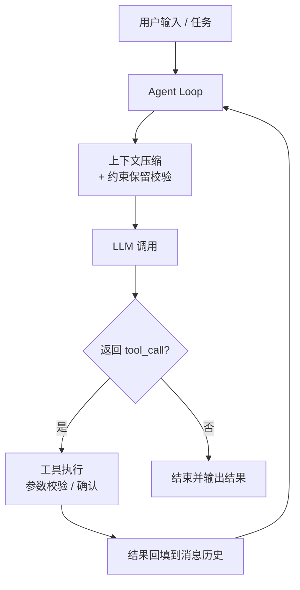

# LiteCoding Agent

> 从零实现的终端 Coding Agent，不依赖 LangChain 等 Agent 框架。核心目标：在长任务中**不丢失关键约束**。

**当前状态**：Agent Loop + 6 个工具 + 流式输出 + 四层上下文压缩 + 关键约束保留已完成，记忆系统与 checkpoint 开发中。各功能实现进度见「核心特性」与「路线图」。

## 为什么做

现有 Coding Agent 在长任务中会因上下文压缩丢失早期设定的关键约束（如「必须兼容 Python 3.9」「禁止修改数据库迁移文件」），导致后续步骤违反规则。本项目在复现 Claude Code 核心机制的基础上，重点解决**上下文压缩中的约束静默丢失**问题。

## 核心特性

**已实现：**

- ✅ **项目脚手架**：src-layout 打包，`lite-agent` 入口可用
- ✅ **CLI 骨架**：基于 argparse 的命令行入口与参数解析，`lite-agent chat "任务"` 可执行
- ✅ **Agent Loop**：`while(true)` 主循环，模型返回 tool_call 后就执行并回填结果，`max_turns` 默认 10
- ✅ **LLM Provider**：OpenAI 兼容协议抽象，从环境变量读取 API Key / Base URL / Model
- ✅ **工具系统**：6 个工具全部可用 —— `read_file` / `write_file` / `list_dir` / `edit_file` / `bash` / `grep`（Pydantic 参数校验 + 路径越界拦截）
- ✅ **edit_file 三道防线**：read-before-edit、mtime 防护、`old_string` 唯一性校验（重复时给出行号）
- ✅ **bash 安全与超时**：默认 30s 超时并终止整棵进程树、危险命令需显式确认、输出超 2000 行截断
- ✅ **流式输出**：模型文本逐字写 stdout，工具调用与结果实时写 stderr
- ✅ **四层上下文压缩**：Tier 1 预算截断（头尾保留）/ Tier 2 裁剪重复 / Tier 3 空闲微压缩 / Tier 4 全量摘要；触发线 60% 与 85%，压缩后保留最近 10 条，每层都记录前后 token 数与耗时
- ✅ **关键约束保留（独有）**：约束独立存于 `constraints.json`，压缩前吸收 `[CONSTRAINT]` 声明、摘要时把清单逐条注入 Prompt、摘要回来按 id 校验并补录漏掉的原文。压力档实测：约束原文逐字保留 100%，对照组 93.0%

**开发中：**

- 🚧 **项目记忆**：加载 `AGENTS.md`，按目录层级注入项目规则
- 🚧 **会话持久化**：checkpoint 保存会话状态，支持中断恢复

**计划中：**

- 📋 **MCP 客户端**：手写 JSON-RPC over stdio，接入外部工具
- 📋 **子 Agent 隔离**：独立上下文和工具白名单

## 架构图



> 待补充：模块依赖图（`core` / `tools` / `memory` / `cli` 之间关系），见 `docs/architecture.md`。

## 快速开始

### 环境要求

- Python 3.11+
- 一个支持工具调用的 LLM API（如 Claude、GPT-4o、DeepSeek）

### 安装

```bash
git clone https://github.com/autumnieave/lite-coding-agent.git
# 网络受限时可用 SSH：git clone git@github.com:autumnieave/lite-coding-agent.git
cd lite-coding-agent
python -m venv .venv
source .venv/bin/activate   # Windows PowerShell: .\.venv\Scripts\Activate.ps1
pip install -e ".[dev]"
```

### 配置

参考仓库根目录的 `.env.example`，设置三个环境变量：

```bash
export LLM_API_KEY="your-api-key"
export LLM_BASE_URL="https://api.deepseek.com/v1"   # OpenAI 兼容端点，按需修改
export LLM_MODEL="deepseek-chat"
```

> 配置优先级：**已存在的环境变量 > `.env` 文件**。CLI 会从当前目录起向上最多 5 层查找 `.env`，
> 三种写法都支持：`KEY=VALUE`、`export KEY=VALUE`、`$env:KEY=VALUE`（PowerShell 习惯）。

### 运行

```bash
lite-agent --help                            # 查看用法与参数
lite-agent chat "列出当前目录"                # 执行一次任务
lite-agent chat "列出当前目录" --verbose      # 同上，打印每次工具调用的完整参数与结果
```

> 输出分流：**stdout 只放模型的最终答案**，工具进度默认就实时上报到 **stderr**（`· ` 前缀；`--verbose` 换成 `[verbose] ` 并带完整参数与结果）。因此 `lite-agent chat "..." > answer.txt` 拿到的始终是干净答案。
> 当前进度：Agent Loop + 6 个工具 + 流式输出 + 四层上下文压缩 + 关键约束保留已完成；记忆系统开发中（`memory/agents_md.py` 与 `memory/session.py` 已落地并有单测，**尚未接入 loop / CLI**）；交互式 REPL 见「路线图」。
> 退出码：0 成功 / 1 任务失败（含达到轮数上限）/ 2 配置或用参错误。

## 项目结构

```
lite-coding-agent/
├── src/agent/
│   ├── core/          # Agent Loop、LLM 抽象、上下文管理
│   ├── tools/         # 工具注册表与具体工具
│   ├── memory/        # 项目记忆与会话持久化
│   └── cli/           # 命令行入口
├── tests/             # 单元测试
├── docs/              # 架构与决策文档
├── AGENTS.md          # 项目规则（Agent 启动时加载）
├── pyproject.toml
├── LICENSE
└── README.md
```

## 核心设计

### Agent Loop

主循环只有一条规则：**模型返回 tool_call 就执行，否则结束**。工具执行失败时，错误信息回填给模型，由模型自行修正。

### 上下文压缩与约束保留（独有）

| 层级     | 策略   | 触发条件               |
| -------- | ------ | ---------------------- |
| Tier 1   | 预算截断 | 工具输出超过阈值       |
| Tier 2   | 裁剪重复 | 同文件重复读取、旧搜索结果 |
| Tier 3   | 微压缩   | 空闲后缓存失效         |
| Tier 4   | 全量摘要 | 上下文接近窗口上限     |

**关键约束保留机制**：

- 约束来源：用户显式声明、`AGENTS.md`、Agent 自行识别。
- 存储：独立 `constraints.json`，不参与压缩。
- 保护：摘要 Prompt 强制要求逐条保留约束。
- 校验：压缩后检查约束 ID 是否完整，丢失则重新注入。
- 验证：对比实验，约束违反次数从 X 降至 Y（待补充）。

### 设计取舍

- **为什么不用 LangChain**：AgentExecutor 是黑盒，面试无法解释底层细节；自研可完全掌控循环、压缩和错误恢复。
- **为什么压缩阈值选 60%**：预留缓冲，避免压缩后立即再次触发；60% 是经验值，后续会用实验校准。
- **为什么记忆不用向量数据库**：项目规则是结构化文本，Markdown + 目录层级加载足够，引入向量库增加复杂度和不确定性。

## 路线图

- [x] 项目脚手架与 CLI 入口
- [x] Agent Loop + LLM Provider + 3 个基础工具（`lite-agent chat "任务"` 单次执行）
- [ ] 交互式 REPL（多轮对话）
- [x] 6 个核心工具 + 流式输出
- [x] 四层上下文压缩
- [x] 关键约束保留机制 + 对比实验
- [ ] 项目记忆 + checkpoint
- [x] 单元测试 + GitHub Actions
- [ ] MCP 客户端
- [ ] 子 Agent 隔离

## 评测

**约束保留对比实验**（`scripts/constraint_experiment.py`，真实 `deepseek-flash`，每组 10 次，判定全部脚本化）

| 档位 | 组 | 约束原文逐字保留 | 摘要整段丢失 | 累计补录 | 行为探针失败 |
|---|---|---:|---:|---:|---:|
| 标准（15 条 / 18 轮） | 关闭机制 | 149/150 | 0/10 次 | — | 0/30 |
| 标准（15 条 / 18 轮） | **开启机制** | **150/150** | 1/10 次 | 15 | 0/30 |
| 压力（40 条 / 25 轮） | 关闭机制 | 372/400（93.0%） | 0/10 次 | — | 1/30 |
| 压力（40 条 / 25 轮） | **开启机制** | **400/400** | 6/10 次 | 280 | 2/30 |

压力档：模型 10 次里有 6 次把 40 条约束**整段丢掉**，靠压缩后校验补回；对照组没有补录通道，摘要没写下来就是永久丢失——10 次里有 5 次丢掉了 1~7 条约束**原文**（代号还在）。行为探针（JSON 合法 / 键名 snake_case / 无代码围栏）两组打平：3 项检查只覆盖 40 条约束中的 3 条，衡量不了约束本身，**「违反次数 X→Y」在本设计下给不出显著差异**。

> 待补充：Terminal-Bench 公开任务通过率。
> 复现命令与完整逐次记录见 `docs/evidence.md` 用例五与 `docs/evidence/*.jsonl`。

## 参考

- [claude-code-from-scratch](https://github.com/Windy3f3f3f3f/claude-code-from-scratch) —— 分步教程（13 章 + 双语言实现），工具系统与 MCP / 多 Agent 部分作为架构对照
- [How Claude Code Works](https://github.com/Windy3f3f3f3f/how-claude-code-works) —— 源码级解析，用于理解 Agent Loop 与上下文压缩

## License

MIT，见 [LICENSE](LICENSE)。