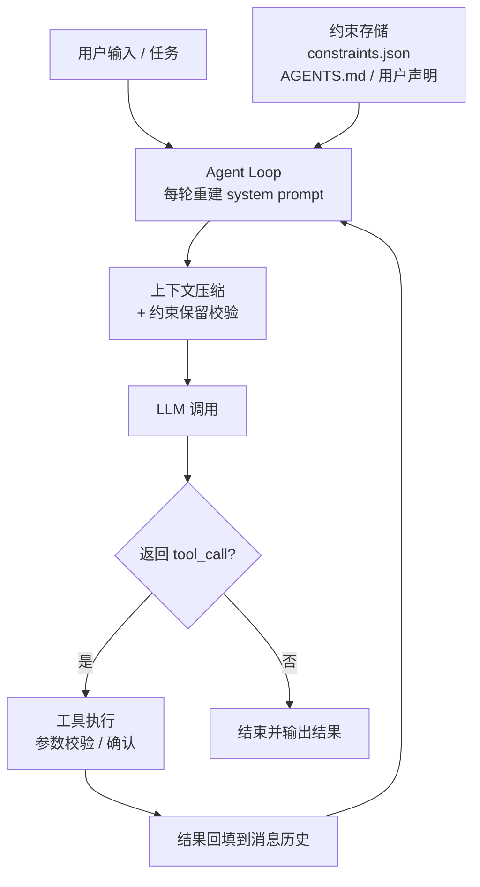

# LiteCoding Agent

> 从零实现的终端 Coding Agent，不依赖 LangChain 等 Agent 框架。核心目标：在长任务中**不丢失关键约束**。

**当前状态**：Agent Loop + 6 个内置工具 + 流式输出 + 四层上下文压缩 + 关键约束保留（压缩通道 + system prompt 通道 + MCP 执行层校验）+ 记忆系统（AGENTS.md 目录层级加载）+ 端到端会话 checkpoint + MCP 客户端（stdio）均已完成。各功能实现进度见「核心特性」与「路线图」。

## 为什么做

现有 Coding Agent 在长任务中会因上下文压缩丢失早期设定的关键约束（如「必须兼容 Python 3.9」「禁止修改数据库迁移文件」），导致后续步骤违反规则。本项目在对照 Claude Code 公开设计的基础上，重点解决**上下文压缩中的约束静默丢失**问题。

## 核心特性

**已实现：**

- ✅ **项目脚手架**：src-layout 打包，`lite-agent` 入口可用
- ✅ **CLI 骨架**：基于 argparse 的命令行入口与参数解析，`lite-agent chat "任务"` 可执行
- ✅ **Agent Loop**：`while(true)` 主循环，模型返回 tool_call 后就执行并回填结果，`max_turns` 默认 10
- ✅ **LLM Provider**：OpenAI 兼容协议抽象，从环境变量读取 API Key / Base URL / Model
- ✅ **工具系统**：6 个工具全部可用 —— `read_file` / `write_file` / `list_dir` / `edit_file` / `bash` / `grep`（Pydantic 参数校验 + 路径越界拦截）
- ✅ **edit_file 三道防线**：read-before-edit、mtime 防护、`old_string` 唯一性校验（重复时给出行号）
- ✅ **bash 安全与超时**：默认 30s 超时并终止整棵进程树、危险命令需显式确认、输出超 2000 行截断
- ✅ **流式输出**：模型文本逐字写 stdout，工具调用与结果实时写 stderr
- ✅ **四层上下文压缩**：Tier 1 预算截断（头尾保留）/ Tier 2 裁剪重复 / Tier 3 空闲微压缩 / Tier 4 全量摘要；触发线 60% 与 85%，Tier 4 压完仍高于触发线时保留窗口按 (10, 5, 3, 1) 阶梯收窄，每层都记录前后 token 数与耗时
- ✅ **关键约束保留（核心差异化机制）**：约束独立存于 `constraints.json`，两条并行注入通道——每轮把清单追加进 system prompt（短任务不压缩也生效），压缩时摘要 Prompt 再逐条保留一次；压缩后按 id 校验并补录漏掉的原文。压力档两批各 10 次、合并 20 次实测：开启「上下文里仍在」800/800、关闭 640/800；逐字保留 95.0% vs 69.0%
- ✅ **项目记忆**：按目录层级向上加载 `AGENTS.md`，C1–C5 解析为 `source=agents_md` 的约束，改文件后下一轮刷新
- ✅ **会话持久化**：`session.jsonl` 逐轮追加，kill 后新进程能恢复消息历史 / token 计数 / 约束状态
- ✅ **MCP 客户端（stdio）**：手写 JSON-RPC over stdio，`initialize` / `tools/list` / `tools/call` 全流程；发现的工具按 `mcp__<server>__<tool>` 注册进工具表。MCP 调用前额外过一道约束校验（本项目原创设计，见 ADR-018）

## 架构图



> 上图只画主链路；完整的模块依赖图（`core` / `tools` / `memory` / `cli` 之间关系）与模块职责表见 `docs/architecture.md`。

## 快速开始

### 环境要求

- Python 3.11+
- 一个支持工具调用的 LLM API（如 Claude、GPT-4o、DeepSeek）

### 安装

```bash
git clone https://github.com/autumnieave/lite-coding-agent.git
# 网络受限时可用 SSH：git clone git@github.com:autumnieave/lite-coding-agent.git
cd lite-coding-agent
python -m venv .venv
source .venv/bin/activate   # Windows PowerShell: .\.venv\Scripts\Activate.ps1
pip install -e ".[dev]"
```

### 配置

参考仓库根目录的 `.env.example`，设置三个环境变量：

```bash
export LLM_API_KEY="your-api-key"
export LLM_BASE_URL="https://api.deepseek.com/v1"   # OpenAI 兼容端点，按需修改
export LLM_MODEL="deepseek-chat"
```

> 配置优先级：**已存在的环境变量 > `.env` 文件**。CLI 会从当前目录起向上最多 5 层查找 `.env`，
> 三种写法都支持：`KEY=VALUE`、`export KEY=VALUE`、`$env:KEY=VALUE`（PowerShell 习惯）。

### 运行

```bash
lite-agent --help                            # 查看用法与参数
lite-agent chat "列出当前目录"                # 执行一次任务
lite-agent chat "列出当前目录" --verbose      # 同上，打印每次工具调用的完整参数与结果
lite-agent chat "用 echo 工具说 hello" --mcp-server "python examples/echo_mcp_server.py"   # 接一个 MCP server
```

> 输出分流：**stdout 只放模型的最终答案**，工具进度默认就实时上报到 **stderr**（`· ` 前缀；`--verbose` 换成 `[verbose] ` 并带完整参数与结果）。因此 `lite-agent chat "..." > answer.txt` 拿到的始终是干净答案。
> 退出码：0 成功 / 1 任务失败（含达到轮数上限）/ 2 配置或用参错误。

## 项目结构

```
lite-coding-agent/
├── src/agent/
│   ├── core/          # Agent Loop、LLM 抽象、上下文管理
│   ├── tools/         # 工具注册表与具体工具
│   ├── memory/        # 项目记忆与会话持久化
│   ├── mcp/           # MCP 客户端（stdio + JSON-RPC）
│   └── cli/           # 命令行入口
├── tests/             # 单元测试
├── docs/              # 架构与决策文档
├── AGENTS.md          # 项目规则（Agent 启动时加载）
├── pyproject.toml
├── LICENSE
└── README.md
```

## 核心设计

### Agent Loop

主循环只有一条规则：**模型返回 tool_call 就执行，否则结束**。工具执行失败时，错误信息回填给模型，由模型自行修正。

### 上下文压缩与约束保留（核心差异化机制）

| 层级     | 策略   | 触发条件               |
| -------- | ------ | ---------------------- |
| Tier 1   | 预算截断 | 工具输出超过阈值       |
| Tier 2   | 裁剪重复 | 同文件重复读取、旧搜索结果 |
| Tier 3   | 微压缩   | 空闲后缓存失效         |
| Tier 4   | 全量摘要 | 上下文接近窗口上限     |

**关键约束保留机制**：

- 约束来源：用户显式声明、`AGENTS.md`、Agent 自行识别。
- 存储：独立 `constraints.json`，不参与压缩。
- 注入（两条并行通道）：每轮把清单追加进 system prompt，短任务不压缩也能看到；压缩时摘要 Prompt 再逐条保留一次。
- 校验：压缩后检查约束 ID 是否完整，丢失则按原文补录回上下文。
- 验证：压力档对比实验（两批各 10 次，合并每组 20 次），关闭机制违反约束 19 次 / 开启机制 5 次；「上下文里仍在」开启组 800/800、关闭组 640/800。详见 `docs/evidence.md` 用例五。

### 设计取舍

- **为什么不用 LangChain**：`AgentExecutor` 是黑盒，循环何时继续、工具错误怎么回填、上下文什么时候被裁都不可见也不可控；自研可以把这三件事完全握在手里。
- **为什么压缩阈值选 60%**：预留缓冲，避免压缩后立即再次触发；60% 是经验值，后续会用实验校准。
- **为什么记忆不用向量数据库**：项目规则是结构化文本，Markdown + 目录层级加载足够，引入向量库增加复杂度和不确定性。

## 路线图

- [x] 项目脚手架与 CLI 入口
- [x] Agent Loop + LLM Provider + 3 个基础工具（`lite-agent chat "任务"` 单次执行）
- [x] 6 个核心工具 + 流式输出
- [x] 四层上下文压缩
- [x] 关键约束保留机制 + 对比实验
- [x] 约束注入 system prompt（短任务不触发压缩也生效）
- [x] 项目记忆 + checkpoint
- [x] 单元测试 + GitHub Actions
- [x] MCP 客户端（stdio + JSON-RPC，含执行层约束校验）

## 评测

**约束保留对比实验**（`scripts/constraint_experiment.py`，真实 `deepseek-flash`，判定全部脚本化）

压力档：40 条约束 / 25 轮会话。下表是修复后代码的 **两批复跑合并**（每组 20 次）：

| 组 | 约束原文逐字保留 | 上下文里仍在 | 压缩后补录 | 违反约束次数 | 任务成功 |
|---|---:|---:|---:|---:|---:|
| 关闭机制 | 552/800（69.0%） | 640/800 | — | 19 | 13/20 |
| **开启机制** | **760/800（95.0%）** | **800/800** | 120 | 5 | 18/20 |

关闭机制的 20 次里有 **4 次把 40 条约束整段丢掉**、另有 **2 次** 40 条还在上下文里但逐字形式全部失去；开启机制遇到同样情况时，压缩后校验按原文逐条补回（累计 120 条），所以「上下文里仍在」始终是 **800/800**。**机制买到的是「整段丢失也丢不掉」这条确定性，不是行为指标的提升**——3 项行为探针只覆盖 40 条约束中的 3 条，衡量不了约束本身。

同一批实验还量化了四层压缩的两处优化收益：Tier 4 触发次数从均值 11.0 / 13.1（最大 21 / 24）降到均值 4.6\~5.4（最大 6\~7）；摘要消息数从「等于压缩次数」降到恒为 1。

> 首轮实验对照组（372/400）在修复摘要叠加 bug 后重跑，回到 69%：那次数据里还残留一条隐式保留通道（旧摘要原文被反复复制进新摘要），拆掉后对照组回到 69% 左右。原因见 `docs/evidence.md` 用例五。
> 尚未纳入：Terminal-Bench 公开任务通过率。
> 复现命令与完整逐次记录见 `docs/evidence.md` 用例五 \~ 用例七与 `docs/evidence/*.jsonl`。

**Agent Benchmark（内部行为评测，非公开榜单）**（`scripts/benchmark.py`，12 个自写任务 × 3 次，真实 `deepseek-flash`，判定脚本化；用于本项目 on/off 对照，不做跨模型排名；下表为 `on` 档）

评的是**行为质量**（工具选择、参数准确、步数预算、错误恢复、约束遵守、长上下文召回），不是答案质量。

**正确性与效率分开看**（`task_success = 内容判定 ∧ 步数判定`）：

| 类别 | 次数 | 内容正确 | 步数达标 | 任务成功 | 平均步数 |
|---|---:|---:|---:|---:|---:|
| retrieval | 12 | 100.0% | 91.7% | 91.7% | 2.2 |
| edit_exec | 12 | 100.0% | 66.7% | 66.7% | 6.3 |
| long_context | 12 | 100.0% | — | 100.0% | 12.3 |

**内容判定 36/36 全为真**（文件找对、`edit_file` 改对、JSON 合法、总行数算对）；
没达标的 5 次全部只挂在步数预算上（A/B 类 24 次里 19 次达标）——B 类反复用
`bash` 试探 Windows shell 绕了路。逐任务稳定性表与两个已修的判定缺陷见 `docs/evidence.md` 用例九。

C 类另补了 `off` 档对照（关闭约束存储、压缩照常发生，每组 12 次）：**内容判定
`on` 12/12 vs `off` 6/12**，`off` 违反 9 次、其中 3 次是约束被压缩整段丢掉。两组 Tier 4 触发次数（36）
与摘要消息数（1）完全相同，差异只来自约束保护——机制买到的是「整段丢失也丢不掉」的确定性。

## 已知限制

完整清单、每条「为什么接受 / 后续怎么改」见 [`docs/evidence.md`](docs/evidence.md) 的「已知限制与后续迭代项」。摘要：

- **Tier 4 触发均值 4.6\~5.4**：压力档修复后均值 4.6\~5.4 / 最大 6\~7，仍在收敛区间。
- **行为验证覆盖面窄**：40 条约束里只有 3 条有输出层判定（JSON / snake_case / 无代码围栏），其余只统计「还在不在上下文里」。
- **约束来源未全覆盖**：对比实验只走「用户声明」一条路径，`source=agents_md` 没有进过实验数据。
- **MCP 只支持 stdio**：没有 SSE / OAuth / 动态工具刷新 / 连接重试。
- **执行层约束校验只看工具名、不看参数**：拦不住「用 echo 工具把 Key 回显出来」这类（ADR-018）。
- **退出时的上游 traceback**：`httpcore2` 关闭流的缺陷，不影响退出码、stdout 与文件改动（ADR-007）。
- **MCP 端到端用例在高负载下偶发失败**：`tests/test_mcp_cli.py` 会真的拉起子进程，已标 `slow`、CI 单独 job 跑；本地 `pytest -q` 仍跑全部 516 条。

## 参考

- [claude-code-from-scratch](https://github.com/Windy3f3f3f3f/claude-code-from-scratch) —— 分步教程（双语言实现，逐章带 Claude Code 架构对照），用作 Agent Loop、工具系统、流式输出、上下文压缩、会话存储的对照来源
- [How Claude Code Works](https://github.com/Windy3f3f3f3f/how-claude-code-works) —— 源码级解析，用于理解 Agent Loop 与上下文压缩

**哪些模块有对照、哪些是自研**（完整表见 `docs/decisions.md` 开头）：

| 模块 | Claude Code 对照 | ADR |
|---|---|---|
| Agent Loop / 工具系统 / 流式输出 / 上下文压缩 / 会话 checkpoint | **有**——对照的是设计取舍，代码全部自写，差异逐条记在 ADR 里 | ADR-006 \~ ADR-011、ADR-013、ADR-015 |
| 项目记忆读 `AGENTS.md` | **部分**——Claude Code 里对应的是 CLAUDE.md 机制，**不是**它那套跨会话 memory 系统（四分类 + 语义召回） | ADR-014 |
| MCP 客户端 | **有**——SDK 封装 / stdio + SSE / 三段式命名 / 15s 超时 | ADR-017 |
| **关键约束保留** | **无，本项目原创**——Claude Code 与参考项目都没有「约束独立存储 + 压缩前注入 + 压缩后校验自愈」 | ADR-004、ADR-012、ADR-016 |
| **MCP 工具的执行层约束校验** | **无，本项目原创**——拦截依据是本项目自己的约束清单 | ADR-018 |

> 所以本项目**不是**「参考 Claude Code 做的复刻」：核心差异化机制（约束保留）是原创，其余模块是照着公开设计重写并记下差异。

## License

MIT，见 [LICENSE](LICENSE)。