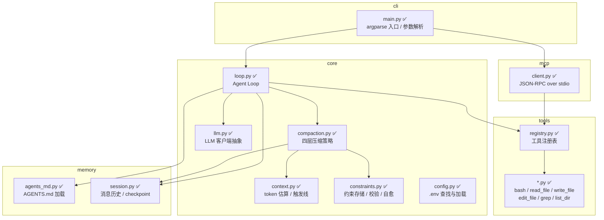
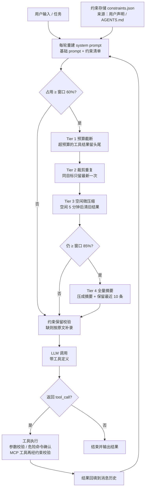
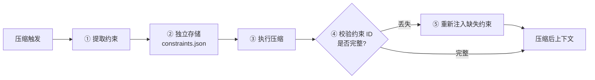

# 架构设计

> **状态说明**：各模块与机制标注如下：✅ 已实现。
>
> 未在本文档出现的机制（如评测体系、具体工具实现细节）尚未确定，不做描述。

## 模块图

> 图中模块均已落地，文件名以实际代码为准。
> 依赖方向：`cli` 是装配层，依赖 `core` / `tools` / `memory` / `mcp`；`tools` 不导入 `core`，
> `core` **不反向依赖**任何一层——工具执行器以 `ToolExecutor` Protocol 注入（ADR-006）。

## Agent Loop 数据流

主循环只有一条规则：**模型返回 tool_call 就执行，否则结束**。

- 工具执行失败不中断循环，错误信息回填给模型，由模型自行修正。
- 压缩发生在 LLM 调用**之前**，否则请求仍会超出上下文窗口。
- 压缩是**逐层降级**的：Tier 1~3 的入口是占用达窗口 60%，每层跑完重新算比例，
  压到线下就不再往下走；只有前三层压不动、占用仍 ≥ 85% 时才动用 Tier 4。
- 约束有**两条并行注入路径**：每轮重建 system prompt 时追加清单（短任务不压缩也可见，ADR-016），
  以及压缩后校验补录（ADR-012）。两条都丢，约束才会真丢。
- MCP 工具在「工具执行」节点额外过一次约束校验（ADR-018，纯自研）。
- 需要人工确认的危险命令（如删除类操作）在「工具执行」节点处拦截。

## 上下文压缩的四层策略

按触发条件从轻到重依次尝试，前一层压到阈值以下则不再进入下一层。

| 层级 | 策略 | 触发条件 | 状态 |
| --- | --- | --- | --- |
| Tier 1 | 预算截断 | 占用 ≥ 60% 且单条工具输出超出字符预算（默认 30000，≥70% 时收紧到 15000） | ✅ |
| Tier 2 | 裁剪重复 | 占用 ≥ 60%，同一目标重复调用过、或搜索/命令类结果超过 3 条 | ✅ |
| Tier 3 | 微压缩 | 占用 ≥ 60% 且距上次 API 调用已空闲 5 分钟 | ✅ |
| Tier 4 | 全量摘要 | 前三层跑完仍 ≥ 窗口 85% | ✅ |

Tier 4 是唯一会**改写语义**的一层，因此也是约束丢失风险最高的位置，需要约束保留机制配合。
实测这一点：摘要 Prompt 里点名要求逐条保留「关键约束」，实测约束确实被保留下来了
（`docs/evidence.md` 用例三）。

Tier 2 / Tier 3 只把工具结果的内容换成占位文本、保留 `tool_calls` 元数据，
模型仍知道自己调用过什么、需要时可以重新读——但内容本身是**有损**的，
只存在于旧工具结果里的信息会随之消失。

## 约束保留流程

| 步骤 | 说明 | 状态 |
| --- | --- | --- |
| ① 提取 | 从用户显式声明、`AGENTS.md` 抽取（模型自行识别尚未实现） | ✅ 部分 |
| ② 存储 | 写入独立文件，**不参与压缩**，因此不会被摘要改写 | ✅ |
| ③ 压缩 | 走四层策略 | ✅ |
| ④ 校验 | 比对压缩前后的约束 ID 集合 | ✅ |
| ⑤ 自愈 | 缺失的约束按原文补录进上下文 | ✅ |

②~⑤ 是**压缩通道**，回答「历史被压缩后约束还在吗」；上面数据流里每轮重建 system prompt
是**可见性通道**，回答「这一轮模型看得见吗」（ADR-016）。两条并行，实测见 `docs/evidence.md` 用例五与用例七。

## 模块职责

| 模块 | 路径 | 职责 | 状态 |
| --- | --- | --- | --- |
| CLI 入口 | `src/agent/cli/main.py` | 参数解析、启动 agent、打印帮助 | ✅ |
| Agent Loop | `src/agent/core/loop.py` | 主循环、工具调用调度、循环终止判断 | ✅ |
| LLM 抽象 | `src/agent/core/llm.py` | 统一不同厂商的 API，处理 tool_call 格式差异 | ✅ |
| 上下文估算 | `src/agent/core/context.py` | token 估算（字符数 / 4）、占用比例与触发线 | ✅ |
| 上下文压缩 | `src/agent/core/compaction.py` | 四层压缩策略、摘要 Prompt、压缩前后 token 与耗时埋点 | ✅ |
| 约束管理 | `src/agent/core/constraints.py` | 约束存储、来源标记、压缩前注入、压缩后校验与自愈 | ✅ |
| 工具注册表 | `src/agent/tools/registry.py` | 工具注册、JSON Schema 参数校验、分发 | ✅ |
| 内置工具 | `src/agent/tools/*.py` | bash、read_file、write_file、edit_file、grep、list_dir | ✅ |
| 项目记忆 | `src/agent/memory/agents_md.py` | 按层级加载 `AGENTS.md` 的「关键约束」并写入约束存储 | ✅ |
| 会话持久化 | `src/agent/memory/session.py` | `session.jsonl` 追加写、消息历史 / token / 约束快照恢复 | ✅ |
| 配置加载 | `src/agent/core/config.py` | 从 cwd 向上查找并加载 `.env` | ✅ |
| MCP 客户端 | `src/agent/mcp/client.py` | 启动 stdio 子进程、JSON-RPC 握手、工具发现与调用 | ✅ |