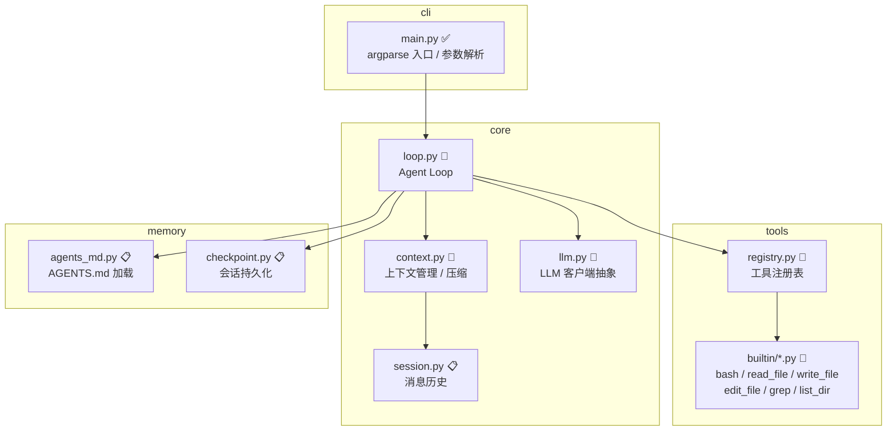
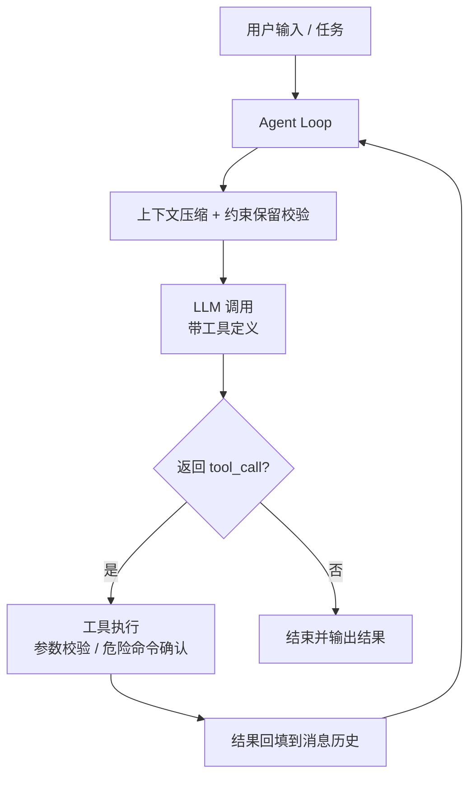
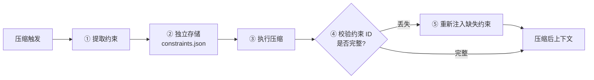

# 架构设计

> **状态说明**：本文档描述**目标架构**，不代表当前已全部实现。各模块与机制标注如下：
> ✅ 已实现　🚧 开发中　📋 设计中
>
> 未在本文档出现的机制（如评测体系、具体工具实现细节）尚未确定，不做描述。

## 模块图

> 除 `cli/main.py` 外，图中文件名均为**设计中**的规划命名，实现时可能调整。

## Agent Loop 数据流

主循环只有一条规则：**模型返回 tool_call 就执行，否则结束**。

- 工具执行失败不中断循环，错误信息回填给模型，由模型自行修正。
- 压缩发生在 LLM 调用**之前**，否则请求仍会超出上下文窗口。
- 需要人工确认的危险命令（如删除类操作）在「工具执行」节点处拦截。

## 上下文压缩的四层策略

按触发条件从轻到重依次尝试，前一层压到阈值以下则不再进入下一层。

| 层级 | 策略 | 触发条件 | 状态 |
| --- | --- | --- | --- |
| Tier 1 | 预算截断 | 单条工具输出超过阈值 | 🚧 |
| Tier 2 | 裁剪重复 | 同一文件重复读取、已被取代的旧搜索结果 | 🚧 |
| Tier 3 | 微压缩 | 空闲后缓存的工具结果失效 | 🚧 |
| Tier 4 | 全量摘要 | 上下文接近窗口上限 | 🚧 |

Tier 4 是唯一会**改写语义**的一层，因此也是约束丢失风险最高的位置，需要约束保留机制配合。

## 约束保留流程

| 步骤 | 说明 | 状态 |
| --- | --- | --- |
| ① 提取 | 从用户显式声明、`AGENTS.md`、模型自行识别中抽取约束 | 🚧 |
| ② 存储 | 写入独立文件，**不参与压缩**，因此不会被摘要改写 | 📋 |
| ③ 压缩 | 走四层策略 | 🚧 |
| ④ 校验 | 比对压缩前后的约束 ID 集合 | 📋 |
| ⑤ 自愈 | 缺失的约束重新注入上下文头部 | 📋 |

约束的完整实现依赖 Tier 4 摘要，因此排在四层压缩之后。

## 模块职责

| 模块 | 路径 | 职责 | 状态 |
| --- | --- | --- | --- |
| CLI 入口 | `src/agent/cli/main.py` | 参数解析、启动 agent、打印帮助 | ✅ |
| Agent Loop | `src/agent/core/loop.py` | 主循环、工具调用调度、循环终止判断 | 🚧 |
| LLM 抽象 | `src/agent/core/llm.py` | 统一不同厂商的 API，处理 tool_call 格式差异 | 🚧 |
| 上下文管理 | `src/agent/core/context.py` | 四层压缩策略、token 预算计算 | 🚧 |
| 消息历史 | `src/agent/core/session.py` | 消息结构定义与增删改 | 📋 |
| 工具注册表 | `src/agent/tools/registry.py` | 工具注册、JSON Schema 参数校验、分发 | 🚧 |
| 内置工具 | `src/agent/tools/builtin/` | bash、read_file、write_file、edit_file、grep、list_dir | 🚧 |
| 项目记忆 | `src/agent/memory/agents_md.py` | 按目录层级加载 `AGENTS.md` 并注入 | 📋 |
| 会话持久化 | `src/agent/memory/checkpoint.py` | checkpoint 保存与中断恢复 | 📋 |